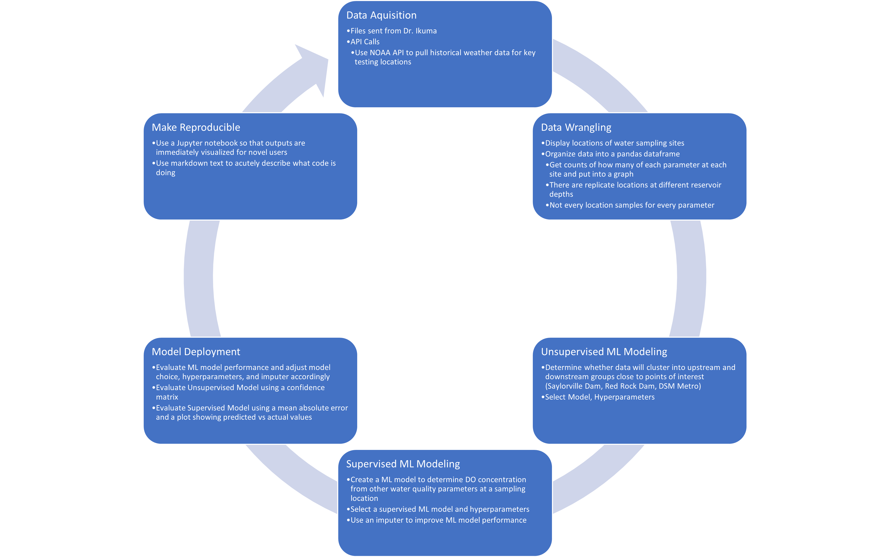
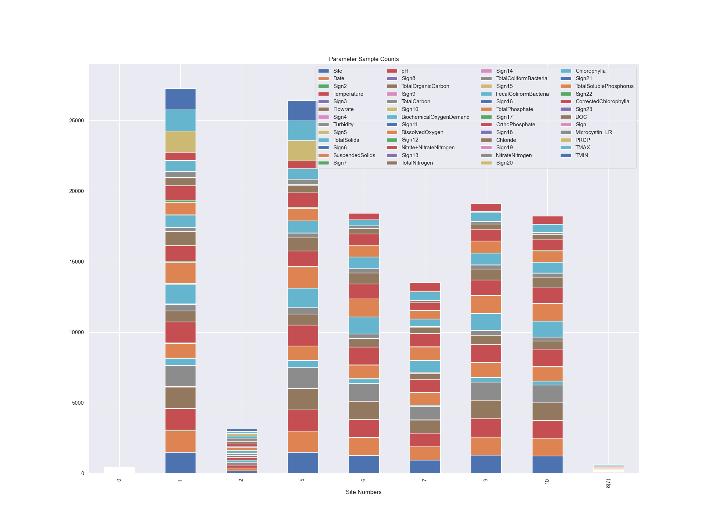
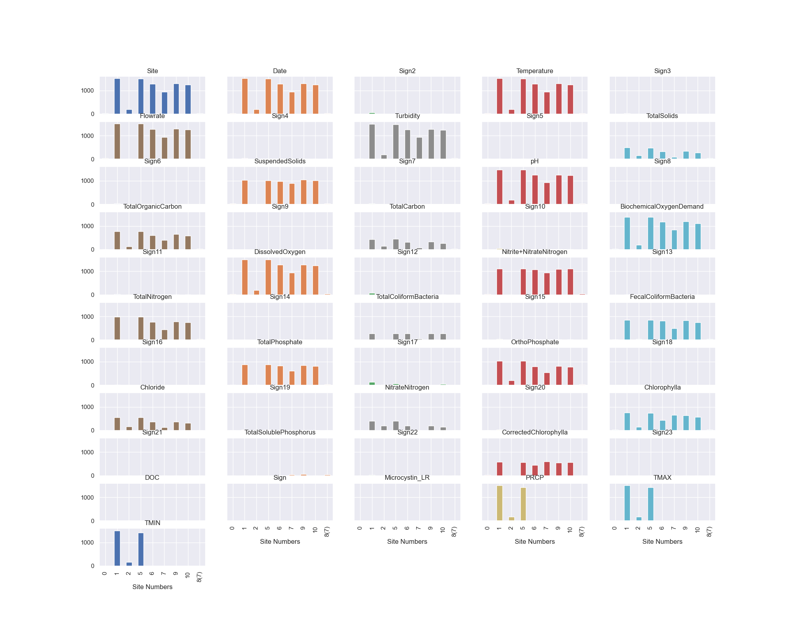
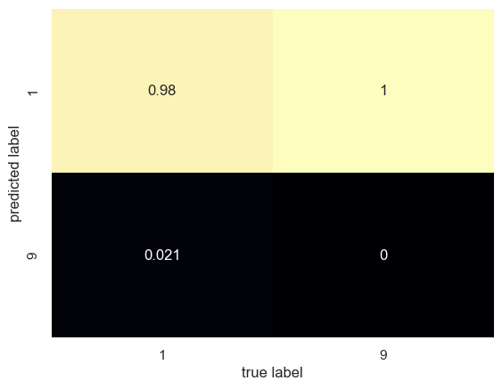
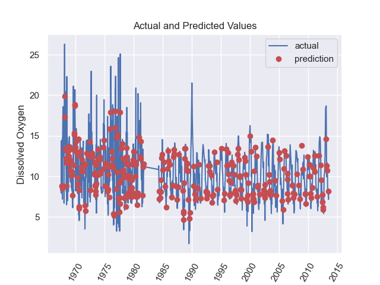
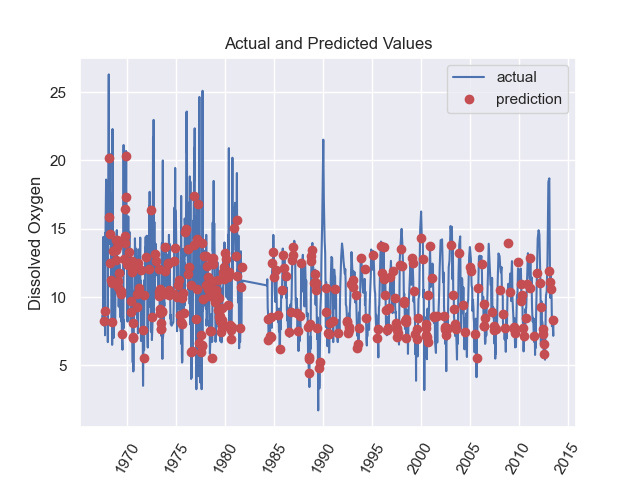
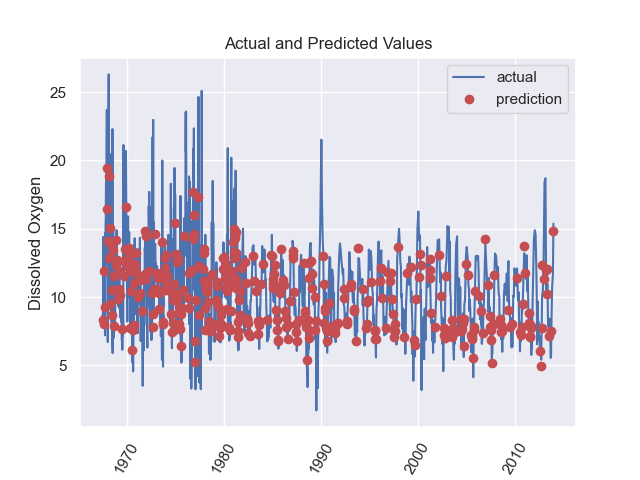

[Link to Analysis Repo](https://github.com/djtenpas/finalprojectanalysis)

[Link to Analysis Jupyter Notebook](https://nbviewer.org/github/djtenpas/finalprojectanalysis/blob/main/516project/Published%20Analysis%20Notebook.ipynb)

***

# Project Description

Because I started attending ISU in January 2023 (the beginning of the seester for this class), I have not collected enough data to use my own project data. This data comes from my advisor, Dr. Kaoru Ikuma, but it does not come from a research group that I am involved in. The data used in this project is water quality data sampled from a variety of locations along the Des Moines and Racoon River.

## Project Goals

One of the main problems my advisor described to me when she gave me this data was that the research group is struggling to figure out what data they have and what they can do with it. Therefore my goals for this project are:

* Wrangling the data and creating helpful visuals so that the gruop can understand **how much** data they have and **where** their data is located.
* Demonstrate concepts learned in this class to show what kind of analyses could be done

## Research Questions

In order to demonstrate multiple concept sin this class, I am exploring 2 research questions with this project:

1. Can I get a machine learning model to differentiate between upstream and downstream data of a point of interest? (Possible points could include Saylorville Dam, Red Rock Dam, and the Des Moines Metro Area)
2. Can I use a machine learning model to predict the dissolved oxygen content in the water at a sampling location?

## Class Concepts

The 5 class concepts I am applying to this project are:

1. Data Wrangling
2. API Calls
3. Unsupervised Machine Learning
4. Supervised Machine Learning
5. Data Imputation

***

# Project Workflow

***

# Project Outputs

Here are a couple examples of the visualizations generated to help the group understand what data they have, how much of it they have, and where it is.

**Stacked Bar Plot**

**Array of Bar Plots**

**KMeans Confidence Matrix**

Here is a confidence matrix for the unsupervised machine learning model, KMeansClustering. As you can see, it was not very good at distinguishing between the two, but I think that is good! It is good to know manmade things along the river have not altered it to such a state that this model can differentiate between upstream and downstream data.

## Supervised Machine Learning Models

Here are some plots of the supervised machine learning models vs. the actual measurements. As you can see, the model does a decent job at detecting when DO is going to change. All models here had an accuracy of ~90%.

**Random Forest Model Predictions vs. Actual Measurements**

**Gradient Boosted Machine Learning Model Predictions vs. Actual Measurements**

**Random Forest Machine Learning Model Trained on Imputed Data Performance**

***

## Project Conclusions

This project pursued answers to two research questions:

1. Can I get a machine learning model to differentiate between upstream and downstream data of a point of interest? (Possible points could include Saylorville Dam, Red Rock Dam, and the Des Moines Metro Area)
2. Can I use a machine learning model to predict the dissolved oxygen content in the water at a sampling location?

*Question 1*

The KMeans model confidence matrix displays the issues that all models enocuntered during this analysis. All unsupervised models that I deployed in this analysis could not differentiate between upstream and downstream datapoints of the different points of interest. It seems that whatever cluster was created first, the model would proceed to put all samples in that cluster. This lead to large numbers of false positives and false negatives. While it is possible that hyperparameters could continue to be optimized to make this eventually possible, I take this as a positive sign for water quality. It is ultimately a good thing that these different locations do not affect water quality in such a way that these models were able to detect differences in the water.

*Question 2*

As shown in the plots above, the supervised machine learning models were able to predict dissolved oxygen content in the water fairly well. All models deployed in this analysis had accuracy scores ~90%. In order to improve accuracy, I attempted to create a larger training datset by using a KNN Imputer to enhance the dataset; however, this did not make much of a difference.

**Class Reflections**

I would not have been able to accomplish any of these project objectives before taking this class. Before this class, the only way I knew how to handle data was using Microsoft Excel. Now that I have taken this class, I can utilize Python to quickly and efficiently wrangle data. I can use imputers, undersampling, and oversampling methods to enhance collected data. I can use unsupervised machine learning models to reduce dimensions in my data, and I can create supervised machine learning models to help create forecasts and predictions.

In addition to the data science skills I mentioned above, I also learned about various research methods. I learned about the importance of publishing data using common standards so that they can be easily consumed for analyses. I also learned about Type 1 and Type 2 errors, and how you cannot eliminate Type 1 Errors without increasing your chance for Type 2 errors and vice versa.

I look forward to applying the skills I learned in this class as I begin my master's research project. I am much better equipped to thoughtfully carry out data analysis thanks to this class.

